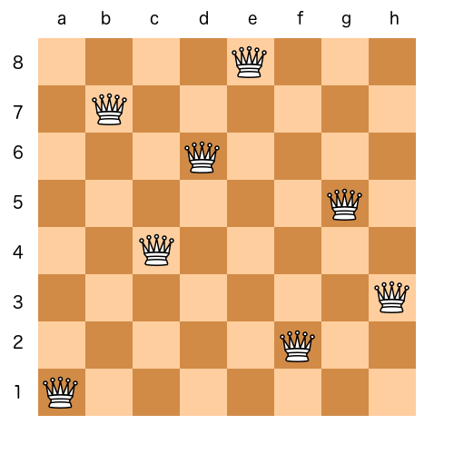

# Genetic-Algorithm-to-solve-8-Queens-problem
Genetic Algorithm implemented in python to solve 8 Queens problem.
  
<h1>Eight queens puzzle</h1>
The eight queens puzzle is the problem of placing eight chess queens on an 8×8 chessboard so that no two queens threaten each other; thus, a solution requires that no two queens share the same row, column, or diagonal. 

  
  

